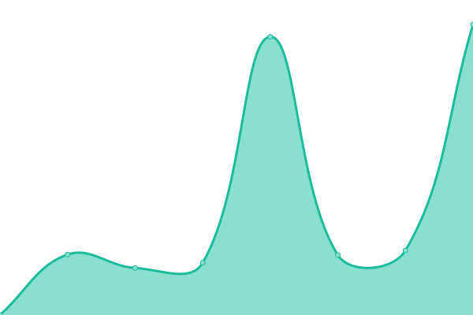

# [📈 Live Status](https://bachmannschumacher.github.io/upptime): <!--live status--> **🟧 Partial outage**

This repository contains the open-source uptime monitor and status page for [Bachmann + Schumacher GmbH](https://bachmannschumacher.github.io/upptime), powered by [Upptime](https://github.com/upptime/upptime).

With [Upptime](https://upptime.js.org), you can get your own unlimited and free uptime monitor and status page, powered entirely by a GitHub repository. We use [Issues](https://github.com/bachmannschumacher/upptime/issues) as incident reports, [Actions](https://github.com/bachmannschumacher/upptime/actions) as uptime monitors, and [Pages](https://bachmannschumacher.github.io/upptime) for the status page.

<!--start: status pages-->
<!-- This summary is generated by Upptime (https://github.com/upptime/upptime) -->
<!-- Do not edit this manually, your changes will be overwritten -->
<!-- prettier-ignore -->
| URL | Status | History | Response Time | Uptime |
| --- | ------ | ------- | ------------- | ------ |
|  [Bachmann + Schumacher Website](https://bachmannschumacher.com) | 🟩 Up | [bachmann-schumacher-website.yml](https://github.com/bachmannschumacher/upptime/commits/HEAD/history/bachmann-schumacher-website.yml) | 

 822ms
     
 | 

<a href="https://bachmannschumacher.github.io/upptime/history/bachmann-schumacher-website">100.00%</a>
    

|  [SM Service](http://smservice.de) | 🟥 Down | [sm-service.yml](https://github.com/bachmannschumacher/upptime/commits/HEAD/history/sm-service.yml) | 

 1265ms
     
 | 

<a href="https://bachmannschumacher.github.io/upptime/history/sm-service">84.87%</a>
    

|  [2rad circle](https://2rad-circle.de) | 🟩 Up | [2rad-circle.yml](https://github.com/bachmannschumacher/upptime/commits/HEAD/history/2rad-circle.yml) | 

 964ms
     
 | 

<a href="https://bachmannschumacher.github.io/upptime/history/2rad-circle">100.00%</a>
    

|  [2rad circle App](https://app.2rad-circle.de) | 🟩 Up | [2rad-circle-app.yml](https://github.com/bachmannschumacher/upptime/commits/HEAD/history/2rad-circle-app.yml) | 

 621ms
     
 | 

<a href="https://bachmannschumacher.github.io/upptime/history/2rad-circle-app">100.00%</a>
    

|  [ERP](https://erpnext.bachmannschumacher.com) | 🟩 Up | [erp.yml](https://github.com/bachmannschumacher/upptime/commits/HEAD/history/erp.yml) | 

 1055ms
     
 | 

<a href="https://bachmannschumacher.github.io/upptime/history/erp">100.00%</a>
    

|  [Winterdienst Akademie](https://learn.bachmannschumacher.com) | 🟩 Up | [winterdienst-akademie.yml](https://github.com/bachmannschumacher/upptime/commits/HEAD/history/winterdienst-akademie.yml) | 

 2216ms
     
 | 

<a href="https://bachmannschumacher.github.io/upptime/history/winterdienst-akademie">100.00%</a>
    

|  [BusCamper](https://bus-camper.de) | 🟩 Up | [bus-camper.yml](https://github.com/bachmannschumacher/upptime/commits/HEAD/history/bus-camper.yml) | 

 2183ms
     
 | 

<a href="https://bachmannschumacher.github.io/upptime/history/bus-camper">100.00%</a>
    

<!--end: status pages-->

[**Visit our status website →**](https://bachmannschumacher.github.io/upptime)

## 📄 License

- Powered by: [Upptime](https://github.com/upptime/upptime)
- Code: [MIT](./LICENSE) © [Bachmann + Schumacher GmbH](https://bachmannschumacher.github.io/upptime)
- Data in the `./history` directory: [Open Database License](https://opendatacommons.org/licenses/odbl/1-0/)
