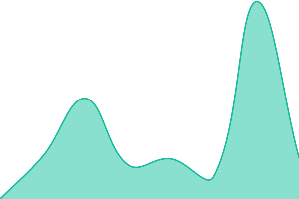
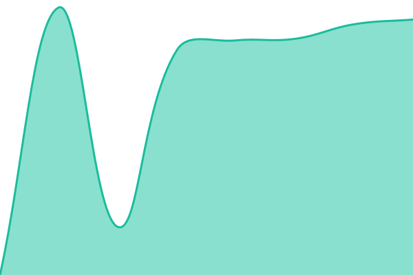

# [📈 Live Status](https://bachmannschumacher.github.io/upptime): <!--live status--> **🟧 Partial outage**

This repository contains the open-source uptime monitor and status page for [Bachmann + Schumacher GmbH](https://bachmannschumacher.github.io/upptime), powered by [Upptime](https://github.com/upptime/upptime).

With [Upptime](https://upptime.js.org), you can get your own unlimited and free uptime monitor and status page, powered entirely by a GitHub repository. We use [Issues](https://github.com/bachmannschumacher/upptime/issues) as incident reports, [Actions](https://github.com/bachmannschumacher/upptime/actions) as uptime monitors, and [Pages](https://bachmannschumacher.github.io/upptime) for the status page.

<!--start: status pages-->
<!-- This summary is generated by Upptime (https://github.com/upptime/upptime) -->
<!-- Do not edit this manually, your changes will be overwritten -->
<!-- prettier-ignore -->
| URL | Status | History | Response Time | Uptime |
| --- | ------ | ------- | ------------- | ------ |
|  [Odoo B+S](https://bachmannschumacher.de) | 🟩 Up | [odoo-b-s.yml](https://github.com/bachmannschumacher/upptime/commits/HEAD/history/odoo-b-s.yml) | 

 1469ms
     
 | 

<a href="https://bachmannschumacher.github.io/upptime/history/odoo-b-s">100.00%</a>
    

|  [Odoo SM](https://odoo.smservice.de) | 🟩 Up | [odoo-sm.yml](https://github.com/bachmannschumacher/upptime/commits/HEAD/history/odoo-sm.yml) | 

 1523ms
     
 | 

<a href="https://bachmannschumacher.github.io/upptime/history/odoo-sm">100.00%</a>
    

|  [Website SM](https://smservice.de) | 🟩 Up | [website-sm.yml](https://github.com/bachmannschumacher/upptime/commits/HEAD/history/website-sm.yml) | 

 640ms
     
 | 

<a href="https://bachmannschumacher.github.io/upptime/history/website-sm">100.00%</a>
    

|  [Bachmann + Schumacher Website](https://bachmannschumacher.com) | 🟩 Up | [bachmann-schumacher-website.yml](https://github.com/bachmannschumacher/upptime/commits/HEAD/history/bachmann-schumacher-website.yml) | 

 1133ms
     
 | 

<a href="https://bachmannschumacher.github.io/upptime/history/bachmann-schumacher-website">100.00%</a>
    

|  [SM Service](http://smservice.de) | 🟩 Up | [sm-service.yml](https://github.com/bachmannschumacher/upptime/commits/HEAD/history/sm-service.yml) | 

 919ms
     
 | 

<a href="https://bachmannschumacher.github.io/upptime/history/sm-service">100.00%</a>
    

|  [2rad-circle](https://2rad-circle.de) | 🟩 Up | [2rad-circle.yml](https://github.com/bachmannschumacher/upptime/commits/HEAD/history/2rad-circle.yml) | 

 3613ms
     
 | 

<a href="https://bachmannschumacher.github.io/upptime/history/2rad-circle">100.00%</a>
    

|  [2rad-circle Shop](https://shop.2rad-circle.de) | 🟩 Up | [2rad-circle-shop.yml](https://github.com/bachmannschumacher/upptime/commits/HEAD/history/2rad-circle-shop.yml) | 

 707ms
     
 | 

<a href="https://bachmannschumacher.github.io/upptime/history/2rad-circle-shop">100.00%</a>
    

|  [ERP](https://erpnext.bachmannschumacher.com) | 🟥 Down | [erp.yml](https://github.com/bachmannschumacher/upptime/commits/HEAD/history/erp.yml) | 

 1088ms
     
 | 

<a href="https://bachmannschumacher.github.io/upptime/history/erp">100.00%</a>
    

|  [Winterdienst Akademie](https://learn.bachmannschumacher.com) | 🟩 Up | [winterdienst-akademie.yml](https://github.com/bachmannschumacher/upptime/commits/HEAD/history/winterdienst-akademie.yml) | 

 3038ms
     
 | 

<a href="https://bachmannschumacher.github.io/upptime/history/winterdienst-akademie">98.11%</a>
    

|  [BusCamper](https://bus-camper.de) | 🟩 Up | [bus-camper.yml](https://github.com/bachmannschumacher/upptime/commits/HEAD/history/bus-camper.yml) | 

 966ms
     
 | 

<a href="https://bachmannschumacher.github.io/upptime/history/bus-camper">100.00%</a>
    

<!--end: status pages-->

[**Visit our status website →**](https://bachmannschumacher.github.io/upptime)

## 📄 License

- Powered by: [Upptime](https://github.com/upptime/upptime)
- Code: [MIT](./LICENSE) © [Bachmann + Schumacher GmbH](https://bachmannschumacher.github.io/upptime)
- Data in the `./history` directory: [Open Database License](https://opendatacommons.org/licenses/odbl/1-0/)
